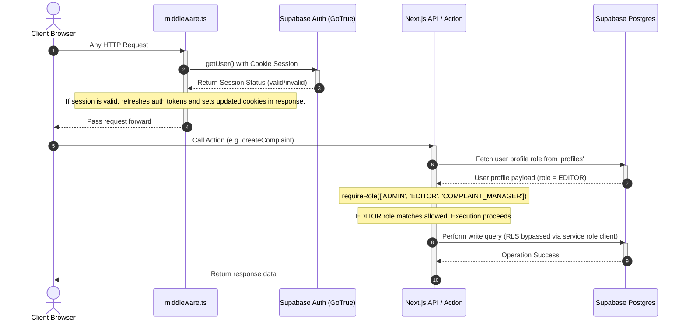

# Authentication & Authorization Flow: GBA · BBMP Ward & Engineer Tracker

This document describes how user sessions, roles, and privileges are managed and enforced.

---

## 1. Authentication Lifecycle

The platform uses **Supabase Auth** mapping user sessions to browser cookies.



---

## 2. User Roles

Every user has a designated role stored in the `profiles.role` column. The role defaults to `VIEWER` if no custom role is assigned in the database.

The 7 roles and their access levels are:

| Role | Domain / Privileges | Access Level |
| :--- | :--- | :--- |
| **`VIEWER`** | Public/Internal viewer. | Read-only access to wards, contacts, complaints, and RTIs. |
| **`FIELD_OFFICER`** | Field inspectors / mobile workers. | VIEWER + upload evidence documents, add field notes, and create quick complaints via phone layout. |
| **`EDITOR`** | Civic record updates. | VIEWER + create/edit contacts, complaints, and RTIs. Cannot verify records. |
| **`VERIFIER`** | Information verification. | EDITOR + change contact verification badges and verify OCR data. |
| **`RTI_MANAGER`** | Right to Information files. | EDITOR + manage statutory RTI applications, appeal submissions, and rule configs. |
| **`COMPLAINT_MANAGER`** | Civic complaint files. | EDITOR + manage full 10-tab complaint files, approve AI extractions, and soft-delete complaints. |
| **`ADMIN`** | System administrator. | Full read/write access across all modules, configuration settings, and hard delete privileges. |

---

## 3. Authorization Guards

Security is enforced at three distinct stages:

### 3.1 Middleware (Route-Level Interception)
- Matches all page requests except static assets (`/((?!_next/static|_next/image|favicon.ico|.*\\.(?:svg|png|jpg|jpeg|gif|webp|ico)$).*)`).
- Refreshes the Supabase session cookie to ensure the client-side session remains valid and synchronized with the auth provider.

### 3.2 Server Actions (Logic Gate)
- Next.js Server Actions execute code on the server. To prevent client-side spoofing, every action calls `requireRole()` from `lib/auth.ts`:
  ```typescript
  export async function createComplaint(formData: FormData) {
    "use server";
    
    // Auth Check: throws AuthorizationError if criteria are not met
    const { user, admin } = await requireRole(COMPLAINT_WRITE_ROLES);
    
    // Process form data safely...
  }
  ```

### 3.3 Database Level (Row Level Security - RLS)
- RLS policies on PostgreSQL tables double-check authentication:
  - Scopes select queries to only return active records for registered users.
  - Requires the matching role in auth functions (such as `can_write()`) for any insert, update, or delete commands submitted via the client connection.
