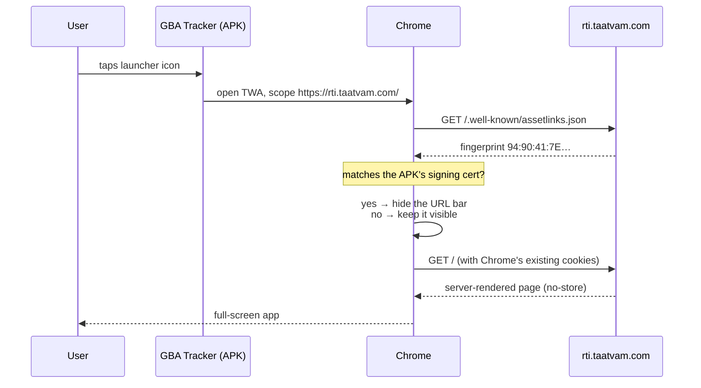
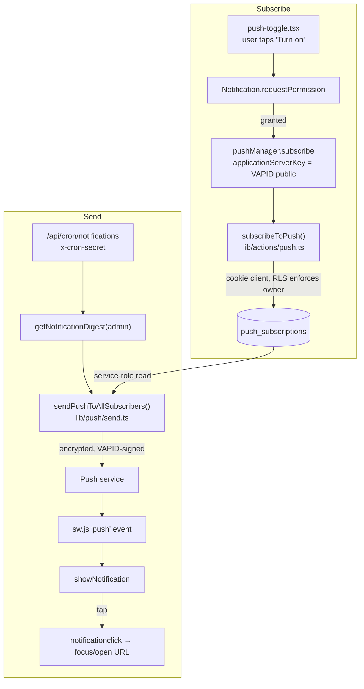

# Mobile App, Live Updates & Web Push — How It All Works

Detailed reference for the Android app (`android-twa/`), the PWA layer that backs
it, Web Push, and the build/release pipeline. Built 2026-08-04.

For the rest of the platform see [`README.md`](README.md),
[`ARCHITECTURE_OVERVIEW.md`](ARCHITECTURE_OVERVIEW.md) and
[`DATABASE_SCHEMA.md`](DATABASE_SCHEMA.md).

---

## Contents

1. [The core idea](#1-the-core-idea)
2. [Why a TWA and not a WebView wrapper](#2-why-a-twa-and-not-a-webview-wrapper)
3. [What happens when a user taps the icon](#3-what-happens-when-a-user-taps-the-icon)
4. [The PWA layer, file by file](#4-the-pwa-layer-file-by-file)
5. [The service worker and the one rule](#5-the-service-worker-and-the-one-rule)
6. [Web Push, end to end](#6-web-push-end-to-end)
7. [The digest and the silent RLS bug](#7-the-digest-and-the-silent-rls-bug)
8. [Signing, and why the keystore matters more than the code](#8-signing-and-why-the-keystore-matters-more-than-the-code)
9. [Build and release pipeline](#9-build-and-release-pipeline)
10. [Distribution: R2 and the /app page](#10-distribution-r2-and-the-app-page)
11. [What updates automatically, and what does not](#11-what-updates-automatically-and-what-does-not)
12. [Environment variables](#12-environment-variables)
13. [Verifying a release](#13-verifying-a-release)
14. [Troubleshooting](#14-troubleshooting)
15. [Security notes](#15-security-notes)

---

## 1. The core idea

The APK is a **~1 MB shell**. It contains no pages, no components, no business
logic — only an Android activity that opens `https://rti.taatvam.com` full-screen
inside Chrome.

That is not a compromise; it is the mechanism that delivers the requirement
*"whatever we change must reach phones without a Play Store update"*:

```
GBA Tracker.apk  ── built once ──▶  a thin Chrome container
                                          │
                                          ▼
                          https://rti.taatvam.com   ← deploy here
                                          │
                                    every phone sees it
                                    on the next screen load
```

**There is no bundled copy of the app to go stale.** Deploying the web app *is*
shipping the Android update. No rebuild, no reinstall, no review queue.

The app could not have been bundled offline in any case: it is server-rendered
(Next.js App Router), and depends on Supabase, server actions, server-side OCR,
PDF/DOCX rendering and AI drafting. A phone holding a copy of the front-end would
still be useless without the server.

## 2. Why a TWA and not a WebView wrapper

A **Trusted Web Activity** hands the URL to the user's real Chrome, running
borderless and branded. A Capacitor/Cordova shell instead embeds a `WebView`,
which is a *different, more limited* engine. That distinction decided the choice,
because this app leans on two things a plain `WebView` silently breaks:

| Feature | In a TWA (real Chrome) | In a plain WebView |
|---|---|---|
| `blob:` + `a.download` saves | Works — goes to the Downloads manager | **Silently does nothing.** No error; the button just looks broken |
| Live `getUserMedia` scanning | Works after the normal Chrome prompt | Needs `CAMERA` in the manifest *and* an `onPermissionRequest` handler |
| `<input type="file">` | Works | Needs an `onShowFileChooser` implementation |
| Web Push | Works | Extra native plumbing |
| Cookie/session persistence | Shares Chrome's jar | Separate store |

Nine components generate documents client-side and hand them over with
`URL.createObjectURL` + `a.download` — for example
[`components/rti/ai-draft-panel.tsx`](components/rti/ai-draft-panel.tsx). Three use
the live camera:
[`components/complaints/scan-capture.tsx`](components/complaints/scan-capture.tsx),
[`components/rti/document-capture.tsx`](components/rti/document-capture.tsx) and
`components/complaints/document-upload.tsx`. Roughly ten more use file pickers.

Choosing a WebView would have meant writing and maintaining a JS↔native bridge to
rescue blob downloads alone. The TWA needs none of it.

Login also mattered: [`app/login/actions.ts`](app/login/actions.ts) uses Supabase
`signInWithPassword` (email **or** phone), with no OAuth anywhere. Google blocks
OAuth sign-in inside embedded WebViews, so an OAuth-based app would have been a
problem — this one is not.

**The trade-off:** a TWA requires Chrome on the device. In practice it always is;
if Chrome is disabled the app degrades to a Custom Tab and still functions
(`fallbackType: "customtabs"` in `twa-manifest.json`).

## 3. What happens when a user taps the icon



Two things worth internalising:

- **The assetlinks check is what removes the URL bar.** Nothing else. If that file
  is missing, wrong, or unreachable, the app still works — it just looks like a
  browser with an address bar.
- **Cookies are Chrome's.** A user already signed in on Chrome is signed in inside
  the app, and vice-versa. Convenient, and worth knowing on a shared device.

## 4. The PWA layer, file by file

The Android app is generated *from* the web manifest, so these files serve double
duty: they make the site installable, and they are the input to the APK build.

| File | Serves | Purpose |
|---|---|---|
| [`app/manifest.ts`](app/manifest.ts) | `/manifest.webmanifest` | Name, colours, icons, `display: standalone`, `scope: /`. **Bubblewrap reads this to generate the APK.** |
| [`scripts/gen-app-icons.ts`](scripts/gen-app-icons.ts) | `public/icons/*.png` | Renders 192, 512 and maskable-512 PNGs. `npm run icons:gen` |
| [`public/sw.js`](public/sw.js) | `/sw.js` | Offline fallback + push handlers. Root scope. |
| [`public/offline.html`](public/offline.html) | `/offline.html` | Static no-network page, precached |
| [`components/pwa/service-worker.tsx`](components/pwa/service-worker.tsx) | — | Registers `/sw.js`; mounted in the root layout |
| [`public/.well-known/assetlinks.json`](public/.well-known/assetlinks.json) | `/.well-known/assetlinks.json` | Digital Asset Links — pins the APK signing cert |
| [`app/app/page.tsx`](app/app/page.tsx) | `/app` | Public install page |

### Icons: why sharp and not the SVG favicon

`app/icon.svg` draws "GBA" as `<text>` in `font-family: system-ui`. Rasterising it
naively produces **a plain blue square with no letters**: sharp renders SVG through
librsvg, which resolves fonts via fontconfig and has no concept of the `system-ui`
CSS keyword. So the generator names concrete families
(`Arial Black, Arial, Helvetica, DejaVu Sans, Liberation Sans`) and reuses the
favicon's exact geometry ratios (`rx = 8/32`, `font-size = 11.5/32`,
`baseline = 20.5/32`) so the launcher icon is the same mark.

It also **fails loudly**: after writing each PNG it counts white pixels and throws
if there are none, because a missing font is otherwise a silent, shipped defect.

`@napi-rs/canvas` would have been the other option and is already a dependency,
but its native binding is blocked on this machine — see
[`.claude/memory/napi-canvas-blocked-locally.md`](.claude/memory/napi-canvas-blocked-locally.md).

The **maskable** variant is separate art, not the same file reused: Android crops
maskable icons to each launcher's shape, so it uses a full-bleed square background
with the mark inset into the centre 80% safe zone. A single `"any maskable"` icon
would get visibly clipped on round-icon launchers.

### Middleware exclusions

[`middleware.ts`](middleware.ts)'s matcher now also skips `sw.js`,
`manifest.webmanifest`, `offline.html` and `.well-known`. `updateSession()` opens a
Supabase client and awaits `getUser()` on every matched request, and none of these
need a session. Two are hot paths: the browser revalidates `sw.js` regularly, and
**Chrome fetches `assetlinks.json` on every app launch** — an auth round trip there
is pure startup latency.

## 5. The service worker and the one rule

> **Never cache HTML or RSC payloads.**

This is the whole design constraint. The app's value proposition is that a deploy
reaches every phone immediately. A service worker that served app documents from
cache would hand users a stale app and quietly destroy that guarantee — the exact
opposite of the point.

So [`public/sw.js`](public/sw.js) is **network-only**, with one narrow exception:

```js
self.addEventListener("fetch", (event) => {
  const { request } = event;
  if (request.method !== "GET" || request.mode !== "navigate") return;
  // try network; on failure serve the precached offline.html
});
```

- Only **top-level navigations** are intercepted, and only to substitute
  `offline.html` when the network is genuinely unreachable.
- Sub-resources, API calls and server actions are left entirely alone. An
  intercepted `POST` or a cached RSC fetch is how a "smart" worker breaks a
  server-rendered app.
- **Nothing is written to the cache at runtime.** The cache is populated once at
  `install` with three static files (`offline.html`, two icons) and never again.
- The server already sends `Cache-Control: private, no-cache, no-store,
  must-revalidate` on documents, so this agrees with the origin rather than
  fighting it.

`offline.html` is a standalone static file, not a Next route — precaching a
Next-rendered page would mean caching HTML, which is the thing being avoided. It
reloads itself on the `online` event so the user does not have to notice.

Bump `CACHE_VERSION` to evict old precaches on the next activate.

## 6. Web Push, end to end

### Who it reaches — and who it does not

This is the most important thing to understand about push here.

The existing overdue-alert **email** digest is addressed to *external BBMP/GBA
officers*, derived from real send history in `letter_emails.recipients` (see the
long header in
[`lib/complaints/overdue-alert-scheduler.ts`](lib/complaints/overdue-alert-scheduler.ts)).
Those officers are not app users. They have no browser, no device, no
subscription — **so push cannot mirror that digest.**

Push instead targets **signed-in staff**, and mirrors what the notifications bell
already shows them. The officer email path is untouched by any of this.

### The flow



### Data model — migration `0052`

[`supabase/migrations/0052_push_subscriptions.sql`](supabase/migrations/0052_push_subscriptions.sql)

| Column | Notes |
|---|---|
| `id` | uuid pk |
| `user_id` | → `auth.users(id)` on delete cascade. **Deliberately not unique** |
| `endpoint` | **unique** — the real identity of a subscription |
| `p256dh`, `auth_key` | per-browser public keys used to encrypt to that endpoint |
| `user_agent` | which device this is, for a human reading the table |
| `last_success_at` | spots a stale-but-not-yet-410 device without reading provider logs |
| `failure_count` | consecutive *transient* failures only |

**One row per device, not per user.** Someone signed in on a phone and a desktop
has two independent endpoints and must be reachable on both. Re-subscribing the
same browser returns the same endpoint, so the action upserts on it rather than
accumulating duplicates.

`auth_key`, not `auth`, to keep the column unambiguous against Supabase's `auth`
schema.

### The two clients, and why each is what it is

This is the part most likely to be "fixed" incorrectly later:

- **Writes use the cookie client.** [`lib/actions/push.ts`](lib/actions/push.ts)
  goes through the signed-in user's client so RLS enforces that a user can only
  register or delete *their own* device. An endpoint is a capability to send that
  device a notification; reaching for `createAdminClient()` here would bypass the
  one check that matters.
- **Sends use the service-role client.** [`lib/push/send.ts`](lib/push/send.ts) runs
  from cron with no session, and RLS on `push_subscriptions` is owner-only — a
  cookie client would read **zero rows**.

### The import-site rule

`lib/push/send.ts` lives under the same constraint as `lib/mail/*`:

> Import it **only** from request-triggered code. Never from anything reachable via
> `instrumentation.ts` → `lib/startup/jobs.ts`.

`web-push` needs Node builtins (`https`, `crypto`, `url`), and that entry point
bundles under the restrictive resolution rules described in `instrumentation.ts`'s
own header — the identical constraint that forced `nodemailer` out of
`overdue-alert-scheduler.ts` and into `lib/jobs/handlers/email-send.ts`. Its only
caller today is `app/api/cron/notifications/route.ts`, a route handler, which is
safe. If push is ever needed from a sweeper, queue a background job and send from
the handler.

### Failure semantics

Deliberate, and unit-tested in
[`__tests__/push-send.test.ts`](__tests__/push-send.test.ts) (13 tests):

| Outcome | Behaviour | Why |
|---|---|---|
| No VAPID keys | `skipped: true`, nothing attempted | A deployment without keys must keep working; email + webhook unaffected |
| Malformed key pair | Treated as unconfigured, warned once | A bad paste into `.env` should not 500 the cron route |
| **404 / 410** | Row **deleted** | The endpoint is permanently gone (app uninstalled, permission revoked, data cleared). Retrying forever fills the table with corpses |
| Any other error | `failure_count + 1`, row kept | A DNS/TLS blip must not delete a good subscription |
| Success | `last_success_at` set, `failure_count` reset to 0 | |
| One device dead | Others still delivered | `Promise.allSettled`, not `all` |

Nothing here throws. A push that fails to reach one phone must not fail the cron
request.

Payload is `{ title, body, url, tag }` with `TTL: 6h` and `urgency: normal`. The
shared `tag: "gba-digest"` means a new digest **replaces** the previous
notification instead of stacking twelve of them — it is a running summary, so a
user who ignores it for a day should find one current notice.

### The opt-in toggle

[`components/nav/push-toggle.tsx`](components/nav/push-toggle.tsx), rendered inside
the notifications bell dropdown.

- **Permission is requested only from a tap.** Calling `requestPermission()` on
  page load is what gets a site permanently blocked — the prompt is one-shot per
  origin, and Chrome penalises it. That is also why the toggle is gated on
  `signedIn`: spending the prompt on a request that cannot succeed (no session ⇒
  no `user_id` ⇒ no row) would leave that user unable to enable alerts later.
- **Renders nothing** when push cannot work (no VAPID public key, or a browser
  without the APIs — most commonly iOS Safari outside an installed app), rather
  than showing a dead control.
- **Rolls back on server failure**: if `subscribeToPush()` fails, the browser
  subscription is torn down, so the UI can never look enabled while no row exists.
- `applicationServerKey` is converted to raw bytes. Chrome accepts a base64url
  string; Firefox does not.

### Delivery trigger

`/api/cron/notifications` is gated on the same `totalDue` as the webhook, which
**deliberately excludes `highRiskAudits`**: that section has no date filter — any
job still in the `bill_stop`/`serious` band qualifies — so counting it would push
an identical notification every day for as long as the finding exists. The audits
still travel in the digest body and the webhook payload.

Tapping a notification deep-links to `/complaints` or `/rti`, whichever category is
larger; a reminders-only digest falls through to the dashboard (reminders have no
list route).

## 7. The digest and the silent RLS bug

Found and fixed while wiring push. Worth reading as a general trap.

`/api/cron/notifications` called `getNotificationDigest()`, which used `sb()` →
the **cookie-scoped** client ([`lib/queries.ts`](lib/queries.ts)). A cron request
carries no session, so it ran as `anon`. Measured against the live database:

| Table | anon sees | service-role sees |
|---|---|---|
| `rti_applications` | 5 | 5 |
| `complaints` | 5 | 5 |
| `reminders` | **0** | 12 |
| `job_audits` | **0** | 2 |

RTIs and complaints are public, so those two sections worked — which is exactly
what made this hard to notice. The digest reported:

| | before | after |
|---|---|---|
| `dueReminders` | **0** | 5 |
| `highRiskAudits` | **0** | 2 |
| `totalDue` | 9 | 14 |

Both suppressed audits were in the **`bill_stop`** band.

**The trap:** RLS denial arrives as an *empty result, not an error*. A query
touching a protected table from a session-less context looks completely
successful and reports nothing. Nothing logs, nothing throws.

The fix keeps one definition of "what is due" — `getNotificationDigest()` now takes
an optional client, and cron passes `createAdminClient()`. It was not re-derived
elsewhere, because this codebase deliberately avoids duplicating that definition.

> **Rule:** any session-less caller of `lib/queries.ts` must pass the admin client
> explicitly. The file header now lists the three tables (`reminders`,
> `job_audits`, `profiles`) that return zero rows to `anon`.

## 8. Signing, and why the keystore matters more than the code

Android identifies an app by **package name + signing key**. Everything else is
replaceable; this is not.

| | |
|---|---|
| Keystore | `D:\gba-bbmp-tracker\secrets\gba-twa.keystore` — **outside the repo** |
| Password | `keystore-password.txt` beside it |
| Alias | `gba-twa` |
| Package | `com.taatvam.rti` |
| Algorithm | RSA 2048, valid until 26 July 2056 |
| SHA-256 | `94:90:41:7E:D7:A6:C2:F8:96:50:2C:6E:3E:25:16:94:13:50:4E:3A:CE:99:05:60:D8:94:DE:59:7E:B2:2D:1C` |

**If the keystore is lost, no future build can update an installed app.** Every
user would have to uninstall and reinstall, under a new package name. Nobody —
including Google — can re-issue it. `.gitignore` blocks `*.keystore`, `*.jks` and
`keystore-password.txt` as a backstop. Full warning and recovery notes live beside
the key itself, at `..\secrets\README-BACKUP-THIS.md` — deliberately not in this
repo, so it is not linked here.

That fingerprint is duplicated in `public/.well-known/assetlinks.json`. **The two
must match.** Change the key and you must update that file and redeploy, or every
installed app falls back to showing a URL bar.

## 9. Build and release pipeline

```
twa-manifest.json ──(bubblewrap update)──▶ Gradle project
                                                │
                          ./gradlew assembleRelease bundleRelease
                                                │
                                    app-release-unsigned.apk
                                                │
                                  zipalign ──▶ apksigner ──▶ signed APK
                                                │
                                    npm run apk:publish ──▶ R2
                                                │
                                            /app serves it
```

Gradle emits an **unsigned** APK on purpose (`app/build.gradle` has no
`signingConfig`); signing is a separate, explicit step. Full commands in
[`android-twa/README.md`](android-twa/README.md).

Bump `appVersionCode` in `twa-manifest.json` before shipping an update — Android
refuses to install an APK whose `versionCode` is not higher than the installed one.

### Two environment obstacles

Both cost real time and neither is a code problem:

1. **`bubblewrap build` does not work here.** It validates the SDK by requiring a
   `tools/` or `bin/` directory at the SDK *root* (an old layout) and pins
   build-tools `36.1.0`. A modern Android-Studio SDK has neither. `bubblewrap
   update` is unaffected — it never touches the SDK — so the flow is *update for
   generation, Gradle for the build*.
2. **Norton intercepts TLS.** It re-signs every HTTPS response with its own local
   root, which Windows trusts but the JDK does not, so all Gradle/Maven downloads
   fail with `PKIX path building failed`. Solved without importing any certificate
   by pointing the JVM at the Windows trust store:
   `-Djavax.net.ssl.trustStoreType=Windows-ROOT` — set in
   `android-twa/gradle.properties`, and also needed as `GRADLE_OPTS` for the
   wrapper's own download (the wrapper JVM starts before `gradle.properties` is
   read). Remove both if ever building on Linux/CI.

### One hand-corrected detail

The APK had to be built *before* the web manifest was deployed, so generation read
a locally-served copy. Bubblewrap wrote that local URL into two generated files;
both were corrected to `https://rti.taatvam.com/...`:

- `android-twa/app/build.gradle` → the `webManifestUrl` `resValue`
- `android-twa/app/src/main/res/raw/web_app_manifest.json`

Re-running `bubblewrap update` once the manifest is live produces the right values
on its own. **Check those two files after any `update`.**

## 10. Distribution: R2 and the /app page

`npm run apk:publish` ([`scripts/publish-apk.ts`](scripts/publish-apk.ts)) writes
two objects, reusing the existing `lib/storage/r2-upload.ts` helper:

| Key | Nature |
|---|---|
| `app/GBA-Tracker-<version>.apk` | Immutable — a version's bytes never change, so an install link stays valid forever |
| `app/latest.json` | The pointer: version, size, sha256, url, timestamps |

**Why the indirection:** `/app` resolves `latest.json` at request time
(`revalidate: 600`), so publishing a new build needs **no site redeploy**.
Overwriting one fixed APK key would be simpler but risks a CDN serving the previous
build's bytes under a URL users already have.

`--dry-run` prints everything and uploads nothing.

[`app/app/page.tsx`](app/app/page.tsx) is **public by design** — whoever installs
has not signed in on that phone yet. It shows the download button, size, version,
SHA-256, plain-language "allow unknown sources" steps, and a QR code so staff can
install straight from a desktop screen. `getRelease()` never throws: an unpublished
or briefly unreachable `latest.json` renders a "not published yet" state, not a 500
on a public page.

The QR is server-rendered SVG with **pinned brand-on-white colours, not theme
tokens** — a scanner needs real contrast, and a transparent QR on the dark theme's
near-black surface is dark blue on dark: fine to look at, unreliable to scan.

## 11. What updates automatically, and what does not

| Change | Rebuild the APK? |
|---|---|
| Any page, component, style, API, query, migration, feature | **No.** Deploy the web app |
| Copy, translations, business rules | **No** |
| Push message wording, digest logic | **No** |
| App name, launcher icon, splash colours | Yes |
| Package id, `targetSdk`, min Android version | Yes |
| Adding a native capability | Yes |

Practically: the shell was built once and will likely never need rebuilding.

## 12. Environment variables

All optional — the app boots and runs fully without them.

| Variable | Purpose |
|---|---|
| `NEXT_PUBLIC_VAPID_PUBLIC_KEY` | Browser uses it as `applicationServerKey`; the server reads the same var, so there is no second public copy to keep in sync |
| `VAPID_PRIVATE_KEY` | Signs pushes. Never reaches the client |
| `VAPID_SUBJECT` | `mailto:`/`https:` contact, required by the VAPID spec |
| `R2_*` (existing) | Where the APK is published |
| `SITE_URL` (existing) | Builds the QR target on `/app` |

Generate a pair with `npx web-push generate-vapid-keys`.

Rotating them invalidates every stored subscription — existing devices keep 410-ing
until each user re-enables alerts — so rotate only if the private key leaks.

[`lib/startup/environment.ts`](lib/startup/environment.ts) warns at boot when both
are missing, and warns **loudly when only one is set**: the toggle renders on the
public key alone, so a missing private key lets staff enable alerts that are never
delivered, with no error anywhere.

## 13. Verifying a release

**Before building** — `npm run typecheck`, `npm run lint`, `npm run test`,
`npm run build`.

**The artifact**, after signing:

```bash
BT="$ANDROID_HOME/build-tools/37.0.0"
"$BT/apksigner.bat" verify --print-certs android-twa/dist/GBA-Tracker-1.0.0.apk
"$BT/aapt2.exe" dump strings android-twa/dist/*.apk | grep -iE "taatvam|localhost"
```

Confirm the cert digest equals the `assetlinks.json` fingerprint (colons removed,
lowercased) and that **no `localhost`/`127.0.0.1` appears**.

**On a device**, in this order — each step depends on the previous one working:

1. **No URL bar** → proves assetlinks is deployed and matches
2. Password login persists across an app restart
3. Live camera document scan
4. A generated PDF/DOCX actually lands in Downloads
5. A file-picker upload
6. Airplane mode shows `offline.html`, not a white screen
7. Hardware back navigates app history, then exits
8. Enable alerts in the bell, then fire the cron route and confirm the
   notification arrives and deep-links correctly

**The live-update guarantee** — change a visible string, deploy, reopen the app:
the change is there with no reinstall.

## 14. Troubleshooting

| Symptom | Cause | Fix |
|---|---|---|
| URL bar visible in the app | `assetlinks.json` missing, unreachable, or fingerprint mismatch | Deploy it; verify with `apksigner verify --print-certs` |
| App shows an old version | A worker is caching documents | `public/sw.js` must stay network-only for navigations. Bump `CACHE_VERSION` |
| Push toggle absent | No `NEXT_PUBLIC_VAPID_PUBLIC_KEY`, unsupported browser, or signed out | Check the boot warning |
| Toggle works, nothing arrives | Half-configured VAPID (public set, private missing) | Boot log names the missing var |
| `push: {"sent":0,...,"reason":"No subscribed devices"}` | Nobody has opted in | Enable alerts in the bell |
| Subscriptions vanish | Correct: 404/410 endpoints are pruned | Re-enable on the device |
| Digest counts look too low | A session-less caller using the cookie client | Pass `createAdminClient()` — see §7 |
| `PKIX path building failed` | Norton TLS interception | `GRADLE_OPTS=-Djavax.net.ssl.trustStoreType=Windows-ROOT` |
| `The provided androidSdk isn't correct` | `bubblewrap build` + modern SDK layout | Use Gradle directly |
| `filename, directory name, or volume label syntax is incorrect` | Backslashes in `local.properties` (a Java properties file escapes them) | Use forward slashes |
| Icons are blank blue squares | Font did not resolve in librsvg | `npm run icons:gen` throws on this now |
| `INSTALL_FAILED_VERSION_DOWNGRADE` | `versionCode` not incremented | Bump it in `twa-manifest.json` |
| Login 500s locally, build dies at "Collecting page data" | Not this system — the canvas binding block | See the memory note; retry |

## 15. Security notes

- **The APK is self-signed.** Expected for direct distribution; it is why Android
  shows a one-time "unknown source" warning. The published SHA-256 lets anyone
  confirm they have the same build.
- **`assetlinks.json` is public and meant to be.** It contains a certificate
  *fingerprint*, not a key. Publishing it proves the app and domain share a
  publisher; it grants nothing.
- **`p256dh` / `auth_key` are not user secrets** — they are per-browser public
  values. But an *endpoint* is a capability to notify that device, which is why RLS
  is owner-only and the subscribe action refuses to use the admin client.
- **The service worker has whole-origin scope.** Keep it minimal and boring; it can
  see every navigation.
- **`VAPID_PRIVATE_KEY` lives only in `.env`** (gitignored) and in the deploy
  environment.
- **TWAs share Chrome's cookie jar.** On a shared device, signing out of Chrome
  signs out of the app.
